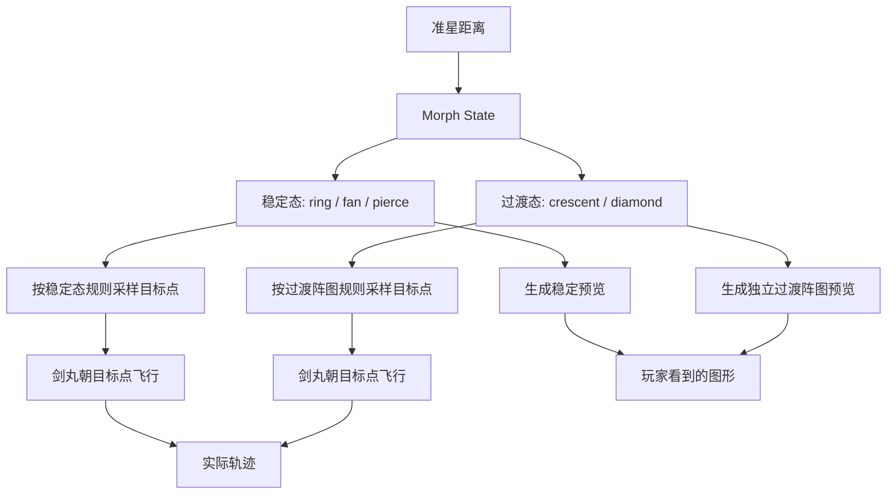
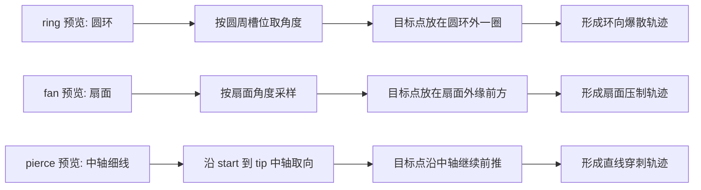
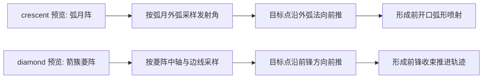
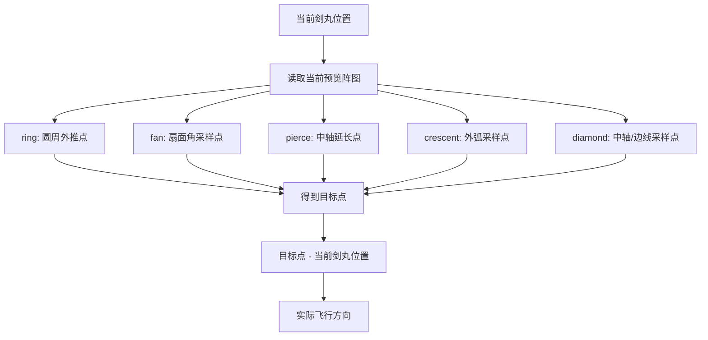
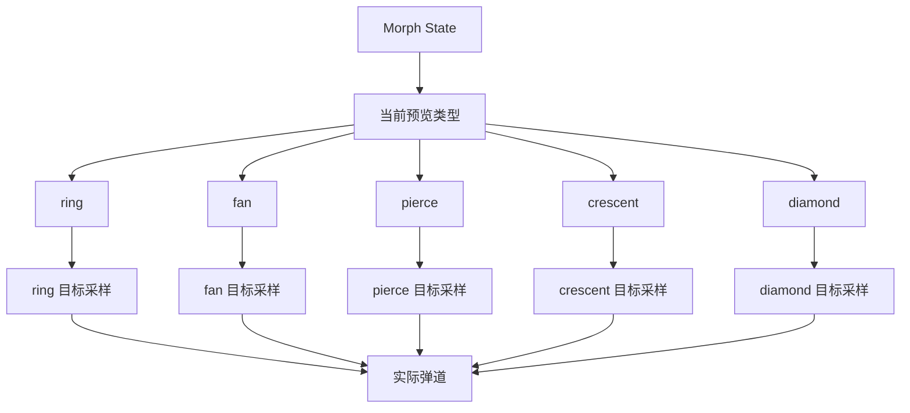

# 剑阵形变系统 V2 轨迹对齐说明

## 1. 文档目的

本文档用于说明剑阵系统在 V2 阶段中：

- 预览图形如何定义
- 发射目标点如何采样
- 实际弹道如何从目标点生成
- 为什么过渡区会出现“预览与轨迹不一致”
- 当前统一后的规则是什么

## 2. 三层概念

| 层级 | 含义 | 作用 |
|---|---|---|
| 预览图形 | 玩家看到的阵图轮廓 | 传达当前剑势覆盖范围与方向 |
| 发射目标点 | 系统为每颗剑丸求出的远端目标 | 决定每颗剑丸应该飞向哪里 |
| 实际弹道 | `目标点 - 剑丸当前位置` 形成的速度方向 | 最终屏幕上看到的飞行轨迹 |

结论：

- 预览图形不直接等于弹道
- 目标点是预览与弹道之间的桥梁
- 如果预览、排布、目标点不是同一套几何，玩家就会感觉“不对齐”

## 3. 整体流程

## 4. 稳定态规则

稳定态沿用 V1/V1.5 已经调过手感的规则。

| 状态 | 预览轮廓 | 目标点采样基准 | 轨迹观感 |
|---|---|---|---|
| `ring` | 圆环 | 圆周槽位角度 | 环向外散 |
| `fan` | 扇面 | 扇面角度分布 | 扇面压制 |
| `pierce` | 中轴细线 | `start -> tip` 中轴 | 直线穿刺 |

## 5. 过渡态规则

V2 不再把过渡区当作三种基础阵型的简单混合，而是定义为独立阵图。

| 状态 | 预览轮廓 | 目标点采样基准 | 轨迹观感 |
|---|---|---|---|
| `crescent` | 弧月阵 | 外弧采样 | 前开口弧形喷射 |
| `diamond` | 箭簇菱阵 | 中轴与边线采样 | 前锋收束推进 |

## 6. 五种状态统一表

| 状态 | 预览图形 | 站位逻辑 | 目标点逻辑 | 玩家感知 |
|---|---|---|---|---|
| `ring` | 圆环 | 环绕均分 | 圆周外推 | 护体爆散 |
| `crescent` | 弧月阵 | 前向弧月排布 | 外弧采样外推 | 护体被向前牵开 |
| `fan` | 扇面 | 分层扇面 | 扇面角度前推 | 中距压制 |
| `diamond` | 箭簇菱阵 | 中轴+肩线+尾点 | 菱阵中轴/边线前推 | 压制面收束成锋 |
| `pierce` | 贯穿细线 | 窄线/楔列 | 中轴前推 | 直线穿刺 |

## 7. 单颗剑丸几何关系

## 8. 之前不一致的根因

之前的错误不是绘制本身，而是数据源分裂：

- 吸附站位已经切到 `crescent / diamond`
- 预览图形已经切到 `crescent / diamond`
- 发射目标却仍使用旧的 `ring / fan / pierce` 混合结果

因此玩家看到的是一套新阵图，打出去却是另一套旧逻辑的混合轨迹。

## 9. 当前定案

当前统一规则如下：

- 稳定态继续沿用成熟的稳定采样规则
- 过渡态直接按独立阵图采样
- 预览、待发排布、目标点、实际弹道必须共享同一套阵图语言

## 10. 当前实现结论

当前系统应满足：

- 稳定态 `ring / fan / pierce` 保持原有手感
- 过渡态 `crescent / diamond` 不再混用旧模式目标
- 过渡区轨迹与预览的偏差应显著缩小
- 后续调优应主要集中在阵图参数，而不是继续变动结构
